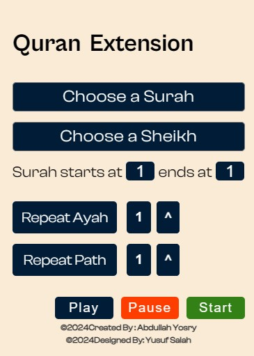

<h1 align="center">quran-extension</h1>

Are you looking for a convenient way to listen to the Quran while working? Look no further! I'm thrilled to announce the launch of my new Chrome extension designed for Quran recitation enthusiasts like you.

## Installation

1. Download the Extension
2. Extract the ZIP File
3. Enable Developer Mode in Chrome
4. Install the Extension

Congratulations! Enjoy 🥳

## Features

1. Listen to the Quran seamlessly while browsing.
2. Customize the number of times an ayah is repeated according to your preference.
3. Repeat specific segments of the audio as many times as you wish.
4. Access recordings from multiple sheikhs, enriching your recitation experience.

## Technologies Used

